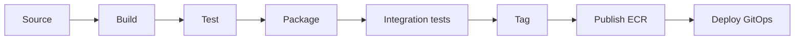

# modelmatch-backend

> FastAPI backend for **ModelMatch** — a deterministic model recommender, a CI savings engine with a
> quality gate, two in-cluster LLM capabilities (catalog ingestion + grounded chat), **and** the
> containerised CI code-review agent. Part of the [ModelMatch portfolio build](../CLAUDE.md);
> full spec in [`../docs/planning/`](../docs/planning/).

## Table of Contents

- [Overview](#overview)
- [Architecture](#architecture)
- [Technology Stack](#technology-stack)
- [Repository Structure](#repository-structure)
- [Prerequisites](#prerequisites)
- [Getting Started](#getting-started)
- [CI/CD Pipeline](#cicd-pipeline)
- [Conventions](#conventions)
- [Release History](#release-history)
- [Contact](#contact)

## Overview

ModelMatch helps a team **prove a cheaper LLM is good enough for their CI — and shows the money saved.**
This repo is the backend and the source of the CI agent image.

Key features:

- **Deterministic recommender (NO LLM)** — form inputs → filter the benchmark catalog → weighted score
  (`rank_score = w_q·quality + w_c·(1 − cost)`) → suggested model + a baseline. A pure function: same
  inputs → same output, `rank_score` stored for audit.
- **Catalog ingestion (#3, LLM)** — unstructured model/benchmark sources → Bedrock Nova extract →
  **validated** structured rows → upsert. **Idempotent** (content-hash → skip unchanged); sources to S3.
- **CI savings loop** — per `ci_run`: `actual = tokens × selected.price`,
  `baseline = tokens × baseline.price`, `savings = baseline − actual`; an acceptance-rate **quality
  gate** excludes failing runs and surfaces them as quality risk.
- **Grounded Q&A chat (#4, LLM)** — questions answered **only** from retrieved savings + catalog data,
  with a visible retrieval trace and an honest out-of-scope refusal.
- **CI code-review agent (`agent/`)** — the product's proof: reviews the PR diff (security + style) and
  the pass/fail **gate stays in the user's CI**. BYOK, provider-agnostic.

The three LLM uses sit behind one `LLMClient` interface (fake client + fixtures for offline tests).

## Architecture

The backend is the FastAPI tier of a 3-tier app (React SPA → FastAPI → in-cluster PostgreSQL). It does
real LLM work in three governed places under a **two-surface model rule**: the in-cluster backend
(ingestion + chat) runs **Bedrock Nova Lite / 2-Lite via IRSA** (no static keys); the **CI agent** is
**BYOK** in the user's Jenkins (any provider). The recommender never calls a model — the LLM *fills* the
catalog and *answers questions*, the formula *ranks*.

Conceptual diagrams (editable draw.io sources — open in the draw.io / VSCode extension):

- [`docs/diagrams/three-llm-uses-ci-savings.drawio`](docs/diagrams/three-llm-uses-ci-savings.drawio) — the three LLM uses + CI savings flow
- [`docs/diagrams/recommender-and-ingestion.drawio`](docs/diagrams/recommender-and-ingestion.drawio) — deterministic recommender + catalog ingestion
- [`docs/diagrams/data-model.drawio`](docs/diagrams/data-model.drawio) — the data model

Authoritative spec: [`../docs/planning/architecture.md`](../docs/planning/architecture.md).

## Technology Stack

| Category             | Technologies   |
| -------------------- | -------------- |
| **Application**      | Python 3.12 · FastAPI · Pydantic / pydantic-settings |
| **Database**         | PostgreSQL 16 (in-cluster, no pgvector) · SQLAlchemy 2.0 · Alembic |
| **LLM**              | `LLMClient` seam · Bedrock Nova (in-cluster, IRSA) · Anthropic / Gemini adapters (agent BYOK) · fake client + fixtures |
| **Auth**             | JWT (argon2 + pyjwt); per-project token for run-ingest |
| **Blob**             | S3 (ingestion source docs) |
| **Containerization** | Docker (multi-stage, non-root) → ECR — two images: API + CI agent |
| **CI/CD**            | Jenkins — two pipelines (API + `Jenkinsfile.agent`); two-job CI (mock / live-gated) |
| **Testing**          | pytest · testcontainers (real Postgres) · fake LLM + fixtures |
| **Packaging**        | `uv` |

## Repository Structure

```
modelmatch-backend/
├── app/
│   ├── api/            # FastAPI routers
│   ├── models/         # SQLAlchemy models
│   ├── schemas/        # Pydantic schemas (camelCase out)
│   ├── recommend/      # deterministic recommender (NO LLM)
│   ├── ingest/         # catalog ingestion (#3, LLM)
│   ├── chat/           # grounded Q&A chat (#4, LLM)
│   ├── projects/       # projects + Jenkins connection
│   ├── ci/             # CI-run ingest + findings
│   ├── savings/        # savings engine + quality gate
│   ├── observability/  # per-request LLM log line + /metrics
│   ├── llm/            # LLMClient + adapters (bedrock / anthropic / gemini + fake)
│   └── main.py         # app entrypoint (/healthz, /readyz, /metrics)
├── agent/              # CI-agent image (diff → LLMClient review → findings JSON) + Jenkinsfile.agent
├── migrations/         # Alembic (run as a Job/Helm hook, not on startup)
├── tests/              # pytest + testcontainers; fake LLM + fixtures
├── docs/diagrams/      # conceptual architecture diagrams
├── Dockerfile          # multi-stage, non-root
├── pyproject.toml      # uv project
├── .env.example
└── CLAUDE.md
```

## Prerequisites

- Python 3.12 and [`uv`](https://docs.astral.sh/uv/)
- Docker + Docker Compose (for the local DB and integration tests)
- A `.env` copied from `.env.example` (never commit `.env`)

## Getting Started

> **Status: scaffolding (S1).** The full local stack (FastAPI + Postgres + compose, `/healthz` +
> `/readyz`) lands with the S1 scaffold; the commands below are the intended workflow.

```bash
cp .env.example .env          # fill in local values
uv sync                       # install dependencies
docker compose up -d db       # local PostgreSQL
uv run alembic upgrade head   # migrations (separate step, not on startup)
uv run uvicorn app.main:app --reload   # dev server
```

Or bring up the whole stack (FE + BE + DB) from the repo root with `docker compose up`.

## CI/CD Pipeline

Two Jenkins pipelines run from this repo — the API and the CI agent — each:
source → build → test → package → integration tests (`main` & `feature/*`) → tag → publish (ECR) →
deploy (image-tag bump in the GitOps repo). The agent pipeline (`Jenkinsfile.agent`) stops at publish
(no cluster-deploy). Two-job CI: `test-fast` (unit + DB integration, LLM mocked) on every push;
`test-llm-live` (real Bedrock) gated to `main` / a label.



## Conventions

- Config from env via `pydantic-settings` — no hardcoded secrets/URLs.
- Secrets (Jenkins token, BYOK key) stored as refs, never plaintext/logged; **never log diff content.**
- Branching: `feature/<story-id>-<desc>` → PR → `main` (protected). Conventional Commits; SemVer tags.

## Release History

- 0.0.1 — Initial scaffold (repo skeleton + stub entrypoint).

## Contact

Steve Levit — stevelevit230@gmail.com
