# modelmatch-backend

> FastAPI backend for **ModelMatch** — a deterministic model recommender, a CI savings engine with a
> quality gate, two in-cluster LLM capabilities (catalog ingestion + grounded chat), **and** the
> containerised CI code-review agent. Part of the [ModelMatch portfolio build](../CLAUDE.md);
> full spec in [`../docs/planning/`](../docs/planning/).

## Table of Contents

- [Overview](#overview)
- [Architecture](#architecture)
- [Technology Stack](#technology-stack)
- [Repository Structure](#repository-structure)
- [Prerequisites](#prerequisites)
- [Getting Started](#getting-started)
- [Configuration](#configuration)
- [Tests](#tests)
- [CI/CD Pipelines](#cicd-pipelines)
- [Conventions](#conventions)
- [Release History](#release-history)
- [Contact](#contact)

## Overview

ModelMatch helps a team **prove a cheaper LLM is good enough for their CI — and shows the money saved.**
This repo is the backend **and** the source of the CI agent image.

Key features:

- **Deterministic recommender (NO LLM)** — form inputs → filter the benchmark catalog → weighted score
  (`rank_score = w_q·quality + w_c·(1 − cost)`) → suggested model + a baseline + shortlist. A pure
  function: same inputs → same output, `rank_score` stored for audit.
- **Catalog ingestion (#3, LLM)** — unstructured model/benchmark sources → **Bedrock Nova** extract →
  **validated** structured rows → upsert. **Idempotent** (content-hash → skip unchanged); sources to S3.
  The LLM *fills* the catalog; the formula still *ranks*.
- **CI savings loop + quality gate** — per `ci_run`: `actual = tokens × selected.price`,
  `baseline = tokens × baseline.price`, `savings = baseline − actual`. An acceptance-rate **quality gate**
  banks savings only for runs that clear `QUALITY_THRESHOLD`, and surfaces failing runs as quality risk.
- **Grounded Q&A chat (#4, LLM)** — questions answered **only** from retrieved savings + catalog data,
  via a **read-only** DB role, with a visible retrieval trace and an honest out-of-scope refusal.
- **CI code-review agent (`agent/`)** — the product's proof: reviews the PR diff (security + style) and
  the pass/fail **gate stays in the user's CI**. BYOK, provider-agnostic; built as a second image with its
  own pipeline (`Jenkinsfile.agent`).

The three LLM uses sit behind **one `LLMClient` interface** (fake client + recorded fixtures for offline
tests), so the suite runs at **zero token cost**.

## Architecture

The backend is the FastAPI tier of a 3-tier app (**React SPA → FastAPI → in-cluster PostgreSQL**). It does
real LLM work in three governed places under a **two-surface model rule**:

| Surface | Capability | Models | Auth |
|---|---|---|---|
| **In-cluster backend** | ingestion (#3) + chat (#4) | **Bedrock Nova Lite** only | **IRSA** — role scoped to the Nova ARNs + the S3 bucket, no static keys |
| **CI agent** (`agent/`) | PR code review (the proof) | **BYOK** — Anthropic / Gemini / Bedrock | the user's own key, in the user's Jenkins |

The recommender never calls a model. **Demo spectrum:** the agent runs on Steve's Anthropic key —
**Haiku live**, **Sonnet baseline computed** (`tokens × price`, not run) — plus a **Gemini free-tier**
path as a third vendor. Because Gemini's free tier **trains on inputs and allows human review**, it is fed
**only non-confidential demo fixtures** (Anthropic + Bedrock don't train on inputs). The `/ci-runs`
ingestion endpoint is **deterministic — no LLM, zero tokens** — so user CI runs never cost us.

Conceptual diagrams (editable draw.io sources):

- [`docs/diagrams/three-llm-uses-ci-savings.drawio`](docs/diagrams/three-llm-uses-ci-savings.drawio) — the three LLM uses + CI savings flow
- [`docs/diagrams/recommender-and-ingestion.drawio`](docs/diagrams/recommender-and-ingestion.drawio) — deterministic recommender + catalog ingestion
- [`docs/diagrams/data-model.drawio`](docs/diagrams/data-model.drawio) — the data model

Authoritative spec: [`../docs/planning/architecture.md`](../docs/planning/architecture.md).

## Technology Stack

| Category             | Technologies   |
| -------------------- | -------------- |
| **Application**      | Python 3.12 · FastAPI · Pydantic / pydantic-settings |
| **Database**         | PostgreSQL 16 (in-cluster, no pgvector) · SQLAlchemy 2.0 · Alembic |
| **LLM**              | `LLMClient` seam · Bedrock Nova (in-cluster, IRSA) · Anthropic / Gemini adapters (agent BYOK) · fake client + fixtures |
| **Auth**             | JWT (argon2 + pyjwt); per-project token for run-ingest |
| **Blob**             | S3 (ingestion source docs) |
| **Containerization** | Docker (multi-stage, non-root) → ECR — two images: API + CI agent |
| **CI/CD**            | Jenkins — two multibranch pipelines (`Jenkinsfile` API, `Jenkinsfile.agent` agent); two-job CI (fast / full lanes, live-gated) |
| **Testing**          | pytest · testcontainers / compose Postgres · fake LLM + fixtures; Bandit + pip-audit + Trivy gates |
| **Packaging**        | `uv` |

## Repository Structure

```
modelmatch-backend/
├── app/
│   ├── api/            # FastAPI routers
│   ├── auth/           # register/login, JWT (argon2), owner-scoping
│   ├── models/         # SQLAlchemy ORM
│   ├── schemas/        # Pydantic schemas (camelCase out)
│   ├── recommend/      # deterministic recommender (NO LLM)
│   ├── catalog/        # benchmark catalog store + seed
│   ├── ingest/         # catalog ingestion (#3, LLM)
│   ├── chat/           # grounded Q&A chat (#4, LLM; read-only DB role)
│   ├── projects/       # projects + Jenkins connection + per-project token
│   ├── ci/             # CI-run ingest + findings
│   ├── savings/        # savings engine
│   ├── quality/        # acceptance-rate quality gate
│   ├── observability/  # per-request llm_call log line + /metrics
│   ├── llm/            # LLMClient + adapters (bedrock / anthropic / gemini + fake)
│   ├── llm_budget.py   # hourly token cap (Postgres llm_usage tally, shared across replicas)
│   ├── blob_store.py   # ingestion blob backend (fake | s3)
│   ├── secret_store.py # secret-ref backend (fake | aws Secrets Manager)
│   ├── config.py       # pydantic-settings (env only)
│   └── main.py         # app entrypoint (/healthz, /readyz, /metrics)
├── agent/              # CI-agent image (diff → LLMClient review → findings JSON) + Jenkinsfile.agent
├── migrations/         # Alembic (run as a Job/Helm hook, never on startup)
├── tests/              # pytest; fake LLM + fixtures; integration marker uses real Postgres
├── ci/                 # CI helpers (pipeline.env, e2e-stack.sh, e2e-live-check.sh, free-ports.sh)
├── docs/               # runbook + conceptual diagrams
├── Dockerfile          # multi-stage, non-root
├── Jenkinsfile         # API pipeline (P18)
├── Jenkinsfile.agent   # CI-agent pipeline (P19, publish-only)
├── pyproject.toml      # uv project
├── .env.example
└── CLAUDE.md
```

## Prerequisites

- Python 3.12 and [`uv`](https://docs.astral.sh/uv/)
- Docker + Docker Compose (for the local DB and integration tests)
- A `.env` copied from `.env.example` (never commit `.env`)

## Getting Started

> **Status: application feature-complete (v1.0.x).** The recommender, catalog ingestion (#3), savings +
> quality gate, grounded chat (#4), the CI agent, metadata-only Jenkins + mint-once token, and
> observability are all in. The LLM/blob/secret backends default to `fake` (offline, **zero tokens**);
> the real Bedrock/S3/Secrets backends activate in-cluster via IRSA.

Run Postgres in Docker and the backend on the host (hot reload). The one value you **must** change is
`JWT_SECRET` — the placeholder in `.env.example` is rejected at startup (there is no built-in default).

```bash
cp .env.example .env
# REQUIRED: set a real JWT_SECRET, e.g.
#   echo "JWT_SECRET=$(openssl rand -hex 32)" >> .env   # then remove the placeholder line

docker compose up -d db                # local PostgreSQL on :5432
uv sync                                # install dependencies
uv run alembic upgrade head            # build the schema (separate step, never on startup)
uv run uvicorn app.main:app --reload   # dev server on :8000
```

Health/observability: `GET /healthz` (liveness) · `GET /readyz` (readiness) · `GET /metrics`
(Prometheus). Interactive API docs at `http://localhost:8000/docs`.

**New here?** Read the [Runbook & Demo Walkthrough](docs/runbook.md) — product story, the two-surface
model rule, the CI agent proof path, env reference, and an end-to-end demo script.

## Configuration

Config is read from env via `pydantic-settings` (no hardcoded secrets/URLs). The full template is
[`.env.example`](.env.example); the most relevant knobs:

| Variable | Default | Purpose |
|---|---|---|
| `DATABASE_URL` | `postgresql+psycopg://…@localhost:5432/modelmatch` | Postgres connection |
| `JWT_SECRET` | `change-me-in-env` | JWT signing secret (set a real value — placeholder is rejected) |
| `BASELINE_MODEL_ID` | `Claude Sonnet 4.5` | demo baseline (computed, not run) |
| `QUALITY_THRESHOLD` | `0.8` | acceptance-rate gate for banking savings |
| `LLM_CLIENT` | `fake` | **in-cluster** LLM surface: `fake` \| `bedrock` (Nova via IRSA) |
| `BEDROCK_MODEL_ID` | `apac.amazon.nova-lite-v1:0` | in-cluster Nova (ap-south-1 needs the `apac.` inference profile) |
| `AWS_REGION` | `ap-south-1` | region for Bedrock + S3 |
| `S3_BUCKET` | `modelmatch-ingestion-sources` | ingestion source docs |
| `LLM_HOURLY_TOKEN_CAP` | `200000` | hard hourly cap on our Nova spend — **aborts (429)**, not an alert |
| `BLOB_STORE` / `SECRET_STORE` | `fake` / `fake` | ingestion blob / secret-ref backends (`s3` / `aws` in-cluster) |
| `PUBLIC_BASE_URL` | `http://localhost:8000` | where the user's Jenkins POSTs `ci-runs` back (embedded in the snippet) |
| `CI_AGENT_LLM_CLIENT` / `CI_AGENT_MODEL` | `anthropic` / `claude-haiku-4-5` | provider + model baked into the CI snippet (BYOK; never `fake`) |
| `CI_AGENT_MAX_TOKENS` / `CI_AGENT_TOKEN_CEILING` | `1024` / `20000` | per-run output cap + total-token ceiling (aborts the agent run) |

> **Secrets are never literals here.** In the cluster, `JWT_SECRET`, the DB password, and the chat
> read-only DB password arrive via **ESO → AWS Secrets Manager**; Bedrock/S3 access is via **IRSA**. The
> per-request `llm_call` log line records model/latency/tokens/retrieved-context size but **never the diff
> content or secrets**. See the [runbook §9](docs/runbook.md#9-environment-variables) for the complete
> table.

## Tests

All three LLM uses sit behind one `LLMClient` with a **fake client + recorded fixtures**, so the suite
runs **offline at zero token cost** (Postgres must be up — `docker compose up -d db`).

```bash
uv run pytest                          # full suite (fake LLM, offline)
uv run pytest -m "not integration"     # unit only (no DB)
uv run pytest -m integration           # DB-backed tests (real Postgres)

# Live, GATED (spends real tokens — deliberate only)
RUN_LLM_LIVE=1 ANTHROPIC_API_KEY=... uv run pytest tests/test_llm_live.py
```

## CI/CD Pipelines

Two Jenkins **multibranch** pipelines run from this repo, both on the graded persistent controller with
**no static AWS keys** (the EC2 instance role does ECR + the gated Bedrock call; SSH deploy keys push the
tag and the gitops bump). Toolchains (uv, Playwright, Trivy, yq) run as pinned throwaway containers.

### API pipeline — [`Jenkinsfile`](Jenkinsfile) (P18)

Two-job CI as ordered stage groups in one file. Every branch runs the fast + full lanes; only `main` runs
the release tail; only `main` / a `#e2e-live` commit runs the single real-Bedrock path.

```mermaid
graph LR
    A[Source + config] --> B[Fast: Build uv sync]
    B --> C[Static/dep gate<br/>Bandit + pip-audit]
    C --> D[Unit test<br/>no containers]
    D --> E[Full: Package BE image]
    E --> F[Trivy scan]
    F --> G[Integration<br/>real Postgres]
    G --> H[E2E<br/>throwaway compose]
    H --> I[e2e-live · gated<br/>one real Nova call]
    I --> J[Tag · main]
    J --> K[Publish ECR · main]
    K --> L[Deploy<br/>gitops bump · main]
```



The **Deploy** stage bumps `backend.image.tag` in the [gitops](../modelmatch-gitops) umbrella; ArgoCD
syncs it — never a hand `kubectl`/`helm`.

### Agent pipeline — [`Jenkinsfile.agent`](Jenkinsfile.agent) (P19)

The CI agent is **publish-only, not a cluster workload** (it runs in a *user's* Jenkins via `docker run`).
A first **`Detect agent changes`** stage exits green-`skipped` unless an agent-relevant path changed
(`agent/**`, `Jenkinsfile.agent`, dep lockfiles, shared `app/llm/**` + the CI-run/finding schema, or
`FORCE_AGENT_BUILD=true`). Feature/PR → build · test · Trivy only; `main` → also publish the **same tested
digest** to private ECR (instance profile) + a public registry, immutable tags. **No GitOps bump / ArgoCD
/ cluster deploy** — changing the agent default the snippet pulls is a *backend* release, not an agent
deploy.

## Conventions

- Config from env via `pydantic-settings` — no hardcoded secrets/URLs.
- Secrets (Jenkins token, BYOK key) stored as refs, never plaintext/logged; **never log diff content.**
- Branching: `feature/<story-id>-<desc>` → PR (self-review) → `main`. Conventional Commits; SemVer tags.

## Release History

SemVer tags on `main`, one per merged slice. **v1.0.0** marked the *application* releasable — proven
end-to-end against a **live Claude Haiku** CI review ingested to the dashboard. The **v1.0.x** patch line
carries the DevOps-delivery refinements (the boto3/bedrock image so the in-cluster Nova surface works;
HTTP request + DB query + LLM metrics on `/metrics`). The deployed image is currently `1.0.7`.

Highlights: v0.22.0 self-contained image + tests/e2e + real-Jenkins smoke · v0.19.0 metadata-only Jenkins ·
v0.18.0 observability · v0.16.0 catalog accuracy refresh · v0.15.0 grounded chat · v0.13–v0.14 savings +
quality gate + dashboard. Full log: `git tag`.

- 0.0.1 — Initial scaffold (repo skeleton + stub entrypoint).

## Contact

Steve Levit — stevelevit230@gmail.com
</content>
